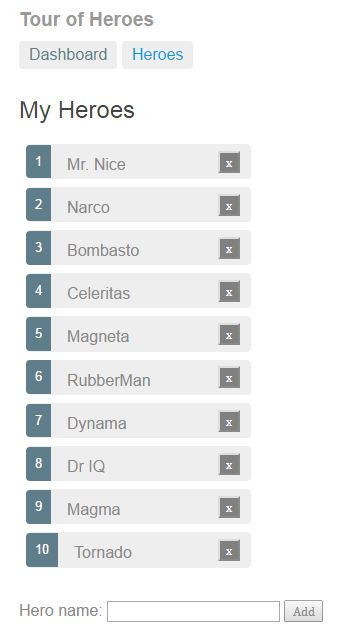

= Spring Boot, AngularJS 2, Kotlin demo

This is a demo which shows how to use Spring Boot, Spring Data JPA and AngularJS 2.
The demo is an implementation of Angular's Tour of Heroes tutorial. The demo is written in Kotlin and TypeScript.

The Heroes are stored in an in-memory H2 database. The H2 schema is managed by Flyway.

You can start the Angular2 App and access it on `http://localhost:3000`:

`gradlew npmStartServer`

You can start the Spring Boot App and access it on `http://localhost:8090`:

`gradlew bootRun`

Webpack proxies the request from Angular2 to Spring Boot.

You can package the Spring Boot App and Angular2 App into one Jar file:

`gradlew build`

The Angular2 App is served as static content under `http://localhost:8090/index.html`, when you start the application`:

`java -jar spring-boot-server-0.1.0.jar`

TODOs:

- [x] Implement Angular's Tour of Heroes tutorial
- Add Angular2 app as a static resource to the Spring Boot app
- Implement authentication/authorization with Spring Security and JWT Tokens

== Angular's Tour of Heroes

